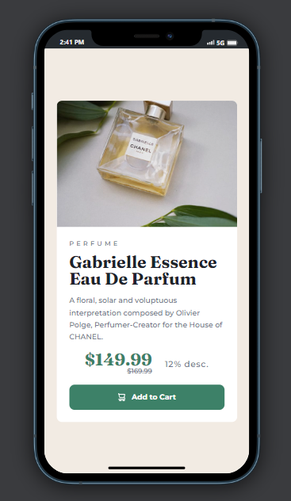

# Frontend Mentor - Product preview card component solution

This is a solution to the [Product preview card component challenge on Frontend Mentor](https://www.frontendmentor.io/challenges/product-preview-card-component-GO7UmttRfa). Frontend Mentor challenges help you improve your coding skills by building realistic projects.

## 📋 Table of contents

- [Overview](#overview)
  - [The challenge](#the-challenge)
  - [Screenshot](#screenshots)
  - [Links](#links)
- [My process](#my-process)
  - [Built with](#built-with)

**Note: Delete this note and update the table of contents based on what sections you keep.**

## 📝 Overview

### The challenge

Users should be able to:

- View the optimal layout depending on their device's screen size
- See hover and focus states for interactive elements

## 📷 Screenshots

### 💻 Desktop version

### 📱 Mobile version

## 🔗 Links

- [Solution](https://github.com/Wedgles97/product-preview-card-component)
- [Live version](https://wedgles97.github.io/product-preview-card-component/)

## 🧮 My process

### Built with

- CSS custom properties
- Flexbox
- Mobile-first workflow
